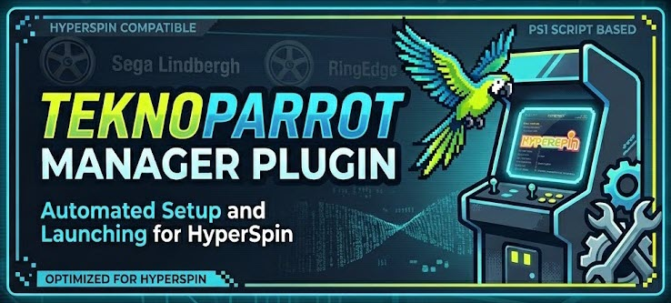

# TeknoParrot Manager - HyperSpin 2 Plugin



[](https://buymeacoffee.com/jumpstile)

Standalone HyperSpin 2 / HyperHQ plugin for TeknoParrot profile maintenance and HyperHQ import.

This repository packages the TeknoParrot tools plugin as its own buildable .NET project with a GitHub Actions release flow. It is intended to complement TeknoParrot and TeknoParrot Manager by exposing the HyperHQ-specific profile and import behavior as an optional plugin instead of baking that behavior directly into HyperHQ.

The implementation was built after reviewing [Jumpstile/teknoparrot-manager](https://github.com/Jumpstile/teknoparrot-manager). It does not copy or bundle that repository's source code.

This is a from-scratch C# port, not a fork -- there's no upstream branch to
merge from. `.github/workflows/watch-upstream.yml` watches that repo's
`main` branch on a daily schedule and opens a tracking issue here (labeled
`upstream-sync`) whenever new commits land, so a human can review and
decide what's worth porting. See ROADMAP.md for what's already ported.

## What It Does

- Validates TeknoParrot folder structure, `TeknoParrotUi.exe`, `UserProfiles`, `GameProfiles`, and `Icons`.
- Scans `UserProfiles/*.xml` and reports valid, broken, empty, and missing `GamePath` values.
- Registers missing user profiles from `GameProfiles/*.xml` templates when a unique executable match is found, a fuzzy folder-name match clears the confidence threshold, or (optionally, but recommended) the Eggman/RomVault collection dat resolves a shared-executable game by name.
- Resolves a dat-provided ProfileCode that doesn't exactly match a local template filename against the live teknogods/TeknoParrotUI profile-code list (falls back to the local GameProfiles listing if unreachable).
- Can check for and download the latest Eggman/RomVault collection dat itself (`check_eggman_dat_update` / `download_eggman_dat`), porting the original PowerShell tool's `Get-EggmanDatRelease`/`Invoke-EggmanDatDownload`. Only runs on explicit user action; the dat is data, never executed. The dat is optional but recommended -- it resolves a lot of games this plugin otherwise couldn't. It's community-maintained by [Eggman](https://github.com/Eggmansworld/TeknoParrot); credit to them for keeping it up to date.
- Repairs broken or empty `GamePath` values only when the matching executable is unambiguous.
- Copies control bindings from one game you've already bound (the "reference game" for that control type -- driving/lightgun/trackball/analog/button) to every other unbound game of the same type, matched by button function so a wheel value never lands on a gun. A reference game's own bindings are never changed by this. An optional control-overrides JSON file (`controlOverridesPath`) can pin a game to a specific reference game, override its auto-detected control type, exclude it from this copying entirely, or -- if two reference games of the same type disagree on their Input API setting -- tell the plugin which one is correct so the other one gets fixed to match (`canonicalArchetype`).
- Offers a read-only device survey that recommends which control to bind for each game type based on what devices you have.
- Deploys a chosen pair of P1/P2 crosshair images (321 bundled, or your own via `crosshairsPath`) to every registered lightgun game, including ElfLdr2 and PCSX2 (with `PCSX2.ini` `cursor_path` updates) special cases, and generates an HTML preview grid to browse them.
- Hides the Windows cursor for every registered lightgun game that defines a cursor-hide field.
- Detects your GPU vendor (AMD/NVIDIA/Intel) via a local WMI query and applies the matching compatibility fix field to every registered profile that has one (`preview_gpu_fix` / `apply_gpu_fix`). Pure local detection plus profile XML edits -- no network calls.
- Installs ReShade (`preview_reshade_setup` / `apply_reshade_setup`) using a user-supplied DLL (this plugin never downloads ReShade itself), auto-detecting each game's exe architecture and graphics API to pick the right DLL and destination filename, with Authenticode signature verification and a read-only `check_reshade_update` version check against reshade.me.
- Installs dgVoodoo2 (`preview_dgvoodoo2_setup` / `apply_dgvoodoo2_setup`) using user-supplied DLLs (this plugin never downloads dgVoodoo2 itself), auto-detecting which registered games use DirectX 8, DirectDraw, or Glide and deploying only the DLL(s) each one needs. Zero network calls.
- Backs up and restores profile XML files, including a pre-restore backup before overwrite.
- Creates and syncs the canonical HyperHQ system `Arcade (TeknoParrot)`.
- Imports TeknoParrot profile XML files as launchable HyperHQ games.
- Exposes a HyperHQ first-run wizard and plugin-page buttons for setup, health checks, registration preview, repair preview, control propagation preview, device survey, sync preview, sync, backup, and restore.

## Relationship To TeknoParrot Manager

TeknoParrot Manager includes many broader Windows setup and game-modification workflows. This plugin intentionally keeps the HyperHQ surface narrower:

- Included: profile discovery, missing profile registration (with dat-index and profile-code fuzzy fallback), unique path repair, control binding propagation, device survey, crosshair deployment, cursor-hide setup, GPU compatibility fix, ReShade setup, dgVoodoo2 setup, health reporting, backups, HyperHQ system/emulator/game import, and wizard/button integration.
- Not included yet: FFB setup, Postgres setup, and BepInEx deployment. See ROADMAP.md.

That boundary is deliberate. HyperHQ should remain the launcher and library manager, while the plugin extends TeknoParrot support where HyperHQ needs structured profile and import behavior.

## HyperHQ Import Contract

- System name: `Arcade (TeknoParrot)`
- System reference ID: `97d957bb-1490-4c1f-b698-08dd285234a8`
- Allowed extensions: `exe|xml|zip`
- Emulator: `TeknoParrot`
- Emulator command: `--profile="%rom.filename%.xml" --startMinimized`
- Game ROM path: the configured `UserProfiles/*.xml` profile path

## Project Layout

```text
.
|-- TeknoParrotHyperHQPlugin.sln
|-- plugin.json
|-- icon.jpg
|-- banner.jpg
|-- CHANGELOG.md
|-- src/
|   |-- TeknoParrotManagerHyperSpin2Plugin/
|   |   |-- TeknoParrotManagerHyperSpin2Plugin.csproj
|   |   `-- Program.cs
|   `-- HyperHQPluginCommon/
|       |-- HyperImportModels.cs
|       `-- PluginSocketIOClient.cs
`-- tests/
    `-- TeknoParrotManagerHyperSpin2Plugin.Tests/
        |-- TeknoParrotManagerHyperSpin2Plugin.Tests.csproj
        |-- PluginManifestTests.cs
        |-- TeknoParrotFixture.cs
        |-- TeknoParrotImportPayloadTests.cs
        `-- TeknoParrotProfileScannerTests.cs
```

The `src` folder contains all buildable plugin source. `src/HyperHQPluginCommon` contains the small HyperHQ plugin transport/import contract needed to run this project as a standalone repository. `banner.jpg` is repo/wiki decoration only (used at the top of this README) -- it is not part of the release package; `icon.jpg` is the plugin icon HyperHQ actually uses, and is the one bundled into release ZIPs.

## Build And Test

Requirements:

- .NET SDK with `net10.0` support

Commands:

```powershell
dotnet restore .\TeknoParrotHyperHQPlugin.sln
dotnet build .\TeknoParrotHyperHQPlugin.sln
dotnet test .\tests\TeknoParrotManagerHyperSpin2Plugin.Tests\TeknoParrotManagerHyperSpin2Plugin.Tests.csproj
dotnet run --project .\src\TeknoParrotManagerHyperSpin2Plugin\TeknoParrotManagerHyperSpin2Plugin.csproj -- --version
```

Basic stdio smoke test:

```powershell
'{"id":"status","method":"execute","data":{"action":"get_status"}}' | dotnet run --project .\src\TeknoParrotManagerHyperSpin2Plugin\TeknoParrotManagerHyperSpin2Plugin.csproj --no-build
```

## GitHub Releases

The repository includes a GitHub Actions workflow at `.github/workflows/release.yml`.

It runs on:

- Version tags shaped like `v0.1.0`
- Manual `workflow_dispatch`

The workflow uses `plugin.json` as the source of truth. On tag builds, the tag version must match the `version` field in `plugin.json` or the workflow fails.

Release command:

```powershell
git tag v0.2.0
git push origin v0.2.0
```

The workflow restores, tests, publishes a Windows x64 self-contained single-file executable, validates package contents, creates a GitHub release, and uploads:

```text
teknoparrot-manager-hyperspin2-plugin-v0.2.0-win-x64.zip
```

The ZIP contains only the HyperHQ runtime files. `.md` docs are git/dev-facing
only and are deliberately not packaged -- `README.txt`, `CHANGELOG.txt`, and
`QUICKSTART.txt` are the newbie-friendly equivalents that ship instead:

- `TeknoParrotManagerHyperSpin2Plugin.exe`
- `plugin.json`
- `README.txt`, `CHANGELOG.txt`, `QUICKSTART.txt`
- `icon.jpg`
- `Crosshairs/` (321 curated crosshair PNGs used by the crosshair deployment action)
- Any additional root-level `*.json` files, if added later
- Any `Icons/` folder, if added later

## HyperHQ Runtime

The plugin manifest is `plugin.json`. HyperHQ launches `TeknoParrotManagerHyperSpin2Plugin.exe` and communicates over Socket.IO when available, with stdio as the fallback path.

Supported direct methods:

- `initialize`
- `updateSettings`
- `execute`
- `getStatus`
- `get_status`
- `onboardingStepExecute`
- `onboarding/step-execute`
- `shutdown`

Supported execute actions:

- `run_setup_wizard`
- `scan_profiles`
- `scan_games`
- `health_check`
- `get_status`
- `status`
- `preview_registration`
- `check_eggman_dat_update`
- `download_eggman_dat`
- `register_games`
- `repair_game_paths`
- `device_survey`
- `preview_control_propagation`
- `propagate_controls`
- `preview_crosshairs`
- `deploy_crosshairs`
- `hide_cursor`
- `preview_gpu_fix`
- `apply_gpu_fix`
- `check_reshade_update`
- `preview_reshade_setup`
- `apply_reshade_setup`
- `preview_dgvoodoo2_setup`
- `apply_dgvoodoo2_setup`
- `preview_sync`
- `sync_games`
- `backup_profiles`
- `restore_backup`
- `onboardingStepExecute`

## Safety Notes

- Registration and repair support dry-run preview before writing profile XML files.
- Existing user profiles are not overwritten during registration.
- Game path repair writes only when there is a unique executable match.
- Restore creates a pre-restore backup of current profiles before replacing files.
- The plugin does not download, install, or run third-party runtime binaries. The optional `eggmanDatPath` setting points at a collection dat -- either one the user already has, or one fetched live via `download_eggman_dat` (see below). Either way, the dat is parsed as data; it is never executed. ReShade and dgVoodoo2 are the same pattern: `reShadeSourceDllPath`/`reShadeSourceDll32Path`/`dgVoodoo2SourcePath` must point at files the user already has -- this plugin never downloads either tool itself, and dgVoodoo2 setup makes no network calls at all.
- Outside HyperHQ's own Socket.IO channel, the plugin makes three kinds of outbound network calls, all read-only or explicitly user-triggered: a fetch of the public teknogods/TeknoParrotUI profile-code list (fails soft to the local GameProfiles listing on any error); the optional Eggman/RomVault collection dat check/download, which only runs when the user explicitly triggers `check_eggman_dat_update` or `download_eggman_dat` (the download's release filename is sanitized via `Path.GetFileName` plus a containment check before being joined into a save path, and its `browser_download_url` is validated against a `github.com`/`githubusercontent.com` host pattern before being fetched); and the optional `check_reshade_update` version check against reshade.me, which never downloads anything, just compares version strings.

## Credits

- The Eggman/RomVault collection dat (used to resolve shared-executable registration matches, and downloadable directly from the plugin) is community-maintained by **Eggman** -- https://github.com/Eggmansworld/TeknoParrot. This plugin does not create or maintain that data, just fetches and reads it.

## Support This Project

This plugin is free to use. If it's been useful to you and you'd like to support continued development: [Buy Me a Coffee](https://buymeacoffee.com/jumpstile). Completely optional -- never required to use any feature of this plugin.
